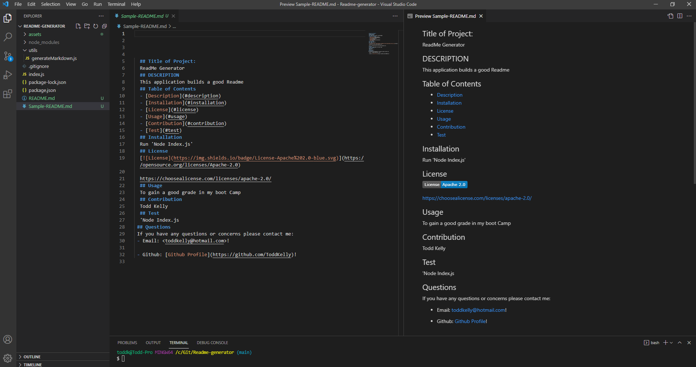

 # README Generator
  
  ## Description
  This is a Node.js based application that can be used to easily create a markdown README file for any application. This application uses the Node.js library Inquirer to prompt the user. The user's responses are then used to generate the README file with corresponding sections. These sections include a Title, Description, Table Of Contents, Installation Instructions, License Information, , Usage Instructions, Contributions, , Testing and contact information to the user's email address and GitHub. 

  Here is a demo of the application:

   
   
   
  Here is a screenshot of the README generated by the demo: 
   
  
